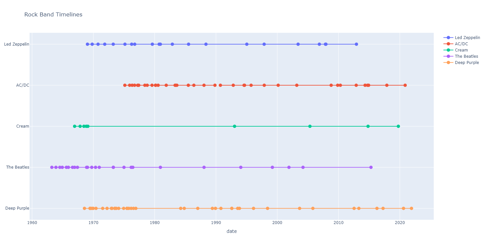
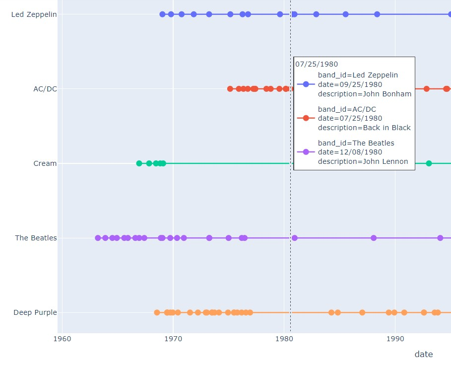

# Rock Band Timelines

A dot plot of rock band activities. A Colab demo is available both [online](https://colab.research.google.com/drive/1KYzdETKzd3t8xYOzpo2LhFmwUJygG73Z?usp=sharing) and locally <code>rock_n_roll_demo.ipynb</code>.

Activities of multiple rock bands are studied as a whole here. Such activities include the release of albums, member changing, and awards. The result is an interactive dot plot:

created on Google Colaboratory using [Plotly](https://plotly.com/python/). In particular, 1980 is not the best year for Rock 'n' Roll:

as we loss [Bon Scott](https://en.wikipedia.org/wiki/Bon_Scott), [John Bonham](https://en.wikipedia.org/wiki/John_Bonham), [John Lennon](https://en.wikipedia.org/wiki/John_Lennon). Even [Deep Purple](https://en.wikipedia.org/wiki/Deep_Purple) was not around.

The visual is generated from the dataset <code>dataset/timeline.csv</code> prepared by the author. Users are free to download and edit their copy.

## References
* Plotly Documentation, [https://plotly.com/python/](https://plotly.com/python/). 
